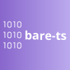

<p align="center">
<a href="#bare-ts"></a>
</p>
<p align="center">
A <em>TypeScript</em> code generator for the <em>BARE</em> binary format
</p>
<div align="center">

[![NPM package][npm-img]][npm-bare-ts-tools]
[![bundle size - minified and gzipped][bundlejs-img]][bundlejs]
[![Coverage][coveralls-img]][coveralls]
</div>

[Binary Application Record Encoding](https://baremessages.org/) (_BARE_) is a schema-based binary
format that favors compactness and composability.
_@bare-ts/tools_ provides a compiler to generate _Typescript_ and _JavaScript_ codes from a _BARE_ schema.

Warning: _BARE_ specification is currently an _IEF_ draft.
The specification is now pretty stable.
However, it may still evolve before its final release.

## Getting started

[![@bare-ts/tools NPM version][npm-bare-ts-tools-img]][npm-bare-ts-tools]
[![@bare-ts/lib NPM version][npm-bare-ts-lib-img]][npm-bare-ts-lib]

First, install _@bare-ts/tools_ and _@bare-ts/lib_:

```sh
npm install --save-dev @bare-ts/tools
npm install @bare-ts/lib
```

-   _@bare-ts/tools_ enables to generate decoders and encoders from a schema

-   _@bare-ts/lib_ provides basic decoders and encoders

Alternatively, you can download a bundled and executable version of _@bare-ts/tools_ named `bare` in the section _Assets_ of every [release on _GitHub_](https://github.com/bare-ts/tools/releases).

Then, write a schema:

```zig
type Gender enum {
    FEMALE
    FLUID
    MALE
}

type Person struct {
    name: str
    email: str
    gender: optional<Gender>
}

type Organization struct {
    name: str
    email: str
}

type Contact union { Person | Organization }

type Contacts list<Contact>
```

Compile your schema into code:

```sh
bare compile schema.bare --out=code.ts
```

Once the code is generated, encode and decode messages:

```ts
import { Gender, decodeContacts, encodeContacts } from "./code.js"
import { strict } from "node:assert"

const contacts = [
    {
        tag: "Person",
        val: {
            name: "Seldon",
            email: "seldon@foundation.org",
            gender: Gender.Male,
        },
    },
]

const payload = encodeContacts(contacts)
const contacts2 = decodeContacts(payload)

strict.deepEqual(contacts, contacts2)
```

## Why BARE?

**Compact messages**: in contrast to _BSON_, _CBOR_, and _MessagePack_, _BARE_ messages do not embed schema information.

**Bijective encoding when possible**: most of BARE values have a single binary representation.
This makes easier the support of use-cases such as message deduplication.

**Focus on modern platforms**: messages are octet-aligned and use little-endian representation.

**Simple**: in contrast to _Protocol Buffer_ and _Flat Buffer_, _BARE_ doesn't constrain its binary format to support schema evolution.
_Protocol Buffer_ embeds metadata in every message and makes optional every field.
_BARE_ recommends using a tagged union as message type to support backward compatibility.

## Why bare-ts?

**Pragmatic error reporting**: _bare-ts_ distinguishes recoverable errors from API misuses.
Decoders may emit recoverable errors (`BareError`) and provide enough information to understand why the message is malformed.
An API misuse emits an `AssertionError`.
_bare-ts_ assumes the use of TypeScript.
This assumption reduces the number of API misuses to check.

**Optimized bundle size**: _bare-ts_ adopts functional and procedural programming styles.
This enables to take advantage of modern _dead-code elimination_ techniques, such as _tree-shaking_.
Using bundlers such as _ESbuild_, _Rollup_, or _Webpack_, your bundle contains only the functions which are actually used.
Moreover, _bare-ts_ uses assertions to express preconditions.
You can use dedicated tools such as [unassert](https://github.com/unassert-js) to remove them.

**Generation of efficient code** _bare-ts_ takes care to generate code that modern JavaScript engines may optimize.

[npm-img]: https://flat.badgen.net/npm/v/@bare-ts/tools
[npm-bare-ts-tools-img]: https://flat.badgen.net/npm/v/@bare-ts/tools?label=npm:@bare-ts/tools
[npm-bare-ts-tools]: https://www.npmjs.com/package/@bare-ts/tools

[npm-bare-ts-lib-img]: https://flat.badgen.net/npm/v/@bare-ts/lib?label=npm:@bare-ts/lib
[npm-bare-ts-lib]: https://www.npmjs.com/package/@bare-ts/lib

[coveralls-img]: https://flat.badgen.net/coveralls/c/github/bare-ts/tools
[coveralls]: https://coveralls.io/github/bare-ts/tools?branch=main

[bundlejs-img]: https://img.shields.io/badge/dynamic/json?style=flat-square&label=minzipped&query=$.size.compressedSize&url=https://deno.bundlejs.com/?q=@bare-ts/tools
[bundlejs-img]: https://deno.bundlejs.com/?q=@bare-ts/tools&badge-style=flat&badge=
[bundlejs]: https://bundlejs.com/?q=%40bare-ts%2Ftools
