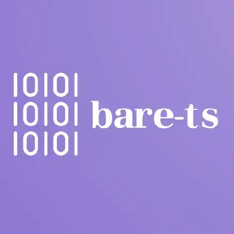

<header style="text-align:center">


# bare-ts

[![CI][ci-img]][ci]
[![Coverage][coveralls-img]][coveralls]
[![NPM version][npm-version-img]][npm]
[![minzipped][bundlephobia-minzip-img]][bundlephobia]

[ci-img]: https://flat.badgen.net/github/checks/bare-ts/tools/?label=CI
[ci]: https://github.com/bare-ts/tools/actions/workflows/ci.yml
[npm-version-img]: https://flat.badgen.net/npm/v/@bare-ts/tools
[npm]: https://www.npmjs.com/package/@bare-ts/tools
[coveralls-img]: https://flat.badgen.net/coveralls/c/github/bare-ts/tools
[coveralls]: https://coveralls.io/github/bare-ts/tools?branch=main
[bundlephobia-minzip-img]: https://flat.badgen.net/bundlephobia/minzip/@bare-ts/tools?label=minzipped
[bundlephobia]: https://bundlephobia.com/package/@bare-ts/tools

</header>

[Binary Application Record Encoding](https://baremessages.org/) (BARE) is a schema-based binary
format that favors compactness and simplicity.
[@bare-ts](#) provides a compiler to generate Typescript or JavaScript
code from a BARE schema.

Warning: _BARE_ specification is currently an _IEF_ draft.
The specification may evolve before its final release.

## Getting started

First, install _@bare-ts/tools_ and _@bare-ts/lib_:

```sh
npm install --save-dev @bare-ts/tools
npm install @bare-ts/lib
```

-   _@bare-ts/tools_ enables to generate decoders and encoders from a schema
-   _@bare-ts/lib_ provides basic decoders and encoders

Alternatively, you can download a bundled and executable version of
_@bare-ts/tools_ named `bare` in the section _Assets_ of every release.

Then, write a schema:

```zig
type Gender enum {
    FEMALE
    FLUID
    MALE
}

type Person struct {
    name: str
    email: str
    gender: optional<Gender>
}

type Organization struct {
    name: str
    email: str
}

type Contact union { Person | Organization }

type Contacts list<Contact>
```

Compile your schema into code:

```sh
bare compile schema.bare --out=code.ts
```

Once the code generated, encode and decode messages:

```ts
import { decodeContacts, encodeContacts, Gender } from "./code.js"
import { strict } from "node:assert"

const contacts = [
    {
        tag: "Person",
        val: {
            name: "Seldon",
            email: "seldon@foundation.org",
            gender: Gender.MALE,
        },
    },
]

const payload = encodeContacts(contacts)
const contacts2 = decodeContacts(payload)

strict.deepEqual(contacts, contacts2)
```

## Why BARE?

**Compact messages**: in contrast to _BSON_, _CBOR_, and _MessagePack_,
_BARE_ messages do not embed schema information.

**Bijective encoding when possible**: most of BARE values have a single binary
representation. This makes easier the support of use-cases such as message
deduplication.

**Focus on modern platforms**: messages are octet-aligned and use little-endian
representation.

**Simple**: in contrast to _Protocol Buffer_ and _Flat Buffer_, _BARE_ doesn't
constrain its binary format to support schema evolution.
_Protocol Buffer_ embeds metadata in every message and
makes optional every field.
_BARE_ recommends using a tagged union as message type
to support backward compatibility.

## Why bare-ts?

**Pragmatic error reporting**: [bare-ts](#) distinguishes recoverable errors
from API misuses.
Decoders may emit recoverable errors (`BareError`) and provide enough
information to understand why the message is malformed.
An API misuse emits a `AssertionError`.
[@bare-ts](#) assumes the use of TypeScript.
This assumption reduces the number of API misuses to check.

**Optimized bundle size**: [bare-ts](#) adopts a functional programming style.
This enables to take advantage of modern _dead-code elimination_ techniques,
such as _tree-shaking_.
Using bundlers such as _ESbuild_, _Rollup_, or _Webpack_, your bundle can
contain only the functions which are actually used.
Moreover, [bare-ts](#) uses assertions to express preconditions.
You can use dedicated tools such as [unassert](https://github.com/unassert-js) to remove them.

**Generation of efficient code** [bare-ts](#) takes care to generate code that
modern JavaScript engines may optimize.
